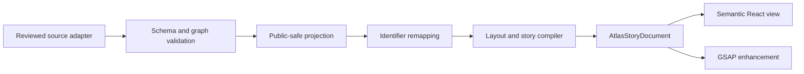

# Architecture

Family History Atlas uses an adapter-first boundary between source records and presentation. The public repository owns validation, projection, layout, narrative composition, and rendering. It does not own a private family database.

The order is a security property. Rendering, layout, counts, animation timing, and analytics never receive the pre-projection source.

## One deep interface

`createFamilyHistoryAtlas().compile(request)` is the principal module interface. A valid public request returns one immutable, render-neutral `AtlasStoryDocument`; failure returns a stable, non-sensitive error code.

The document contains:

- remapped presentation identifiers;
- public-safe people, relationships, and events;
- wide and compact layout coordinates;
- narrative chapters and camera intentions;
- a semantic reading order; and
- research questions already reviewed for publication.

GSAP is a progressive enhancement. React owns content and DOM semantics; animation owns transforms, opacity, and scroll-linked staging. Native page scrolling remains the input model.

## Graph rules

- Person identifiers are unique.
- Every relationship endpoint and event reference resolves to a person.
- Parent, adoptive-parent, and guardian edges form an acyclic ancestry graph.
- Partner and chosen-family edges may connect within a generation and are excluded from ancestry ranking.
- Living and uncertain people are absent from the public document.

## Responsive composition

Wide viewports use a sticky atlas stage with ScrollTrigger-controlled chapter focus. Compact viewports use a vertical generation river and batched reveals; they do not inherit desktop pinning. Reduced-motion mode clears animation-owned properties and presents the semantic document directly.

## Private adapters

A private implementation should depend on this engine at a pinned release or commit, then supply deployment-owned adapters for authentication, authorization, encrypted storage, consent, audit, export, deletion, and restore. Those adapters are intentionally outside the open-source core.
